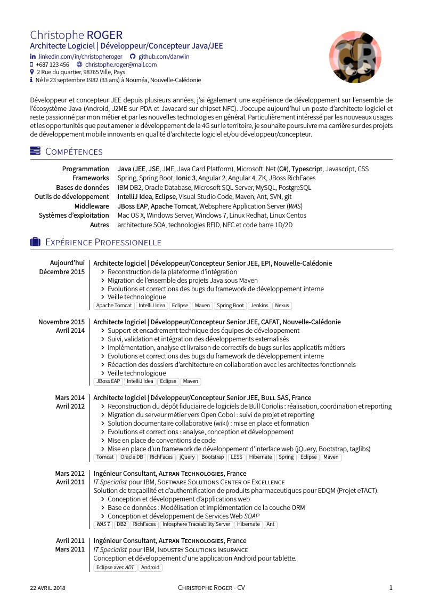
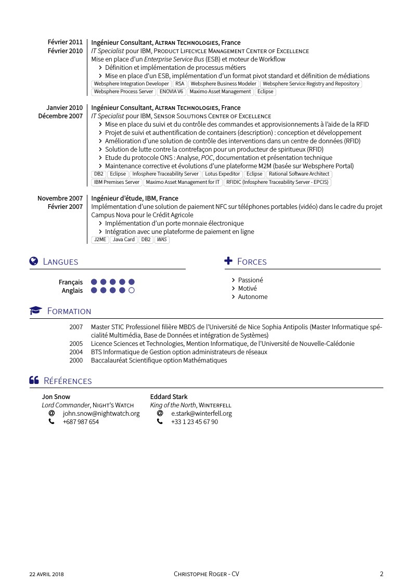
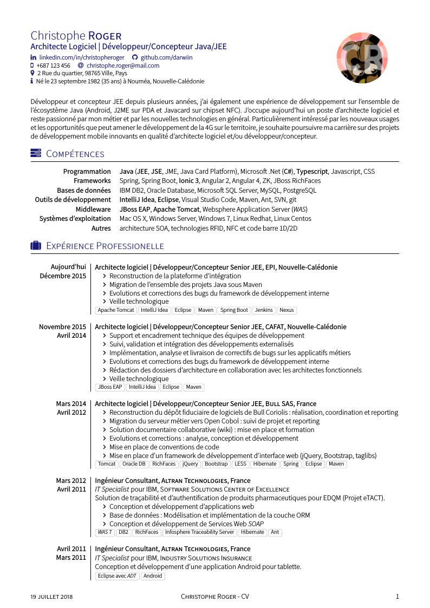
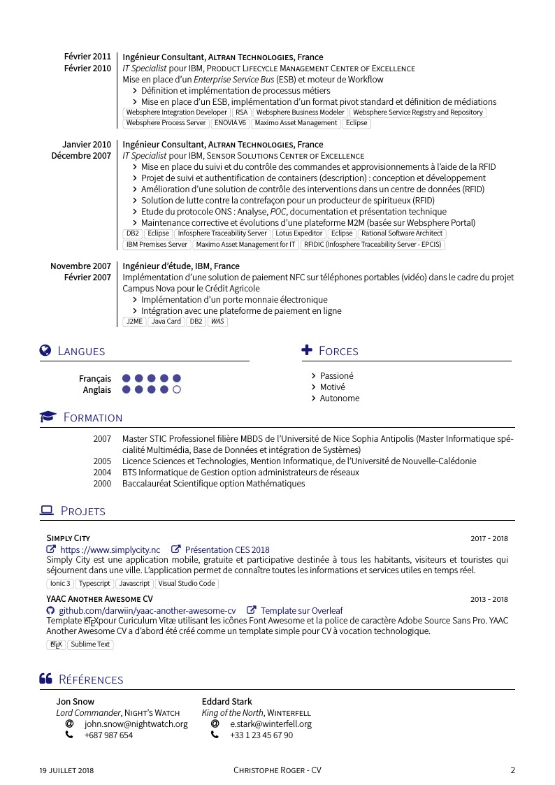

YAAC: Another Awesome CV [](https://circleci.com/gh/darwiin/yaac-another-awesome-cv) [](https://github.com/darwiin/yaac-another-awesome-cv/releases/download/v1.8.0/cv.pdf)
=================

## Quick start

You can edit online **YAAC: Another Awesome CV** template on [Overleaf](https://www.overleaf.com/latex/templates/awesome-source-cv/wrdjtkkytqcw). Feel free to use my [referal link](https://www.overleaf.com/signup?ref=54c221604cd6) if you want to create your account.

## About

**YAAC: Another Awesome CV** was first based on a CV template from Alessandro Plasmati. This template used _XeLaTeX_ engine and _[Fontin Sans](http://www.exljbris.com/fontinsans.html)_ font. 

**Personal data** has moved on top of the first page just before the position and _[Fontin Sans](http://www.exljbris.com/fontinsans.html)_ font has been replaced by _[Source Sans Pro Font](https://github.com/adobe-fonts/source-sans-pro)_ from Adobe. _[Font Awesome](http://fontawesome.io/)_ icons highlight important elements.

Unlike _Alessandro Plasmati_ CV template, all layout stuff in **YAAC: Another Awesome CV** has moved in the Latex class file _yaac-another-awesome-cv.cls_ to improve source code readability and style reusability.

More informations about the original Alessandro Plasmati template can be found here :

   -  [ Scribd ](http://fr.scribd.com/doc/16335667/Writing-your-Professional-CV-with-LaTeX)
   -  [ LaTeX Templates ](http://www.latextemplates.com/template/plasmati-graduate-cv)
   -  [ ShareLatex ](https://www.sharelatex.com/templates/cv-or-resume/professional-cv)

## Preview

### Normal style

| Page. 1 | Page. 2 |
|:---:|:---:|
|  |  |

### Alternative style

| Page. 1 | Page. 2 |
|:---:|:---:|
|  |  |

## How to use **YAAC: Another Awesome CV** latex class

### Use the **YAAC: Another Awesome CV** options

When declaring the `\documentclass` you can use option(s) to customize your CV rendering.
1. **localFont** to use the fonts included in the _fonts_ folder
2. **alternative** to use the _alternative header_ layout
3. **10pt** or **11pt** or **12pt** to change the font size
4. **compact** to reduce vertical space between you experience entries


```latex
% Used with no option, the template will use the 'traditional' 
% header layout your system fonts and the default color scheme ie. blue
\documentclass{yaac-another-awesome-cv}

% Used with localFont option the template will use the 'traditional' 
% header layout, fonts included in the fonts directory and the default color scheme
\documentclass[localFont]{yaac-another-awesome-cv}

% Used with alternative option, the template will use the 'alternative' 
% header layout, your system fonts and the default color scheme
\documentclass[alternative]{yaac-another-awesome-cv}

% Used with localFont, alternative and 10pt options the template will use the 'alternative' 
% header layout, fonts included in the fonts directory, the default color scheme and the '10pt' font size.
% Based on the article document class, size options are 10pt, 11pt and 12pt
\documentclass[localFont,alternative,10pt]{yaac-another-awesome-cv}

% Used with 'compact' option the template will use the compact experience layout 
% Feel free to use this option with the others that are available
\documentclass[compact]{yaac-another-awesome-cv}

```

### Construct the header

Outside of the `\socialinfo` wrapper you have to define the mandatory parameters `\name` and `\tagline`.

```latex
% Define author's name
% Usage: \name{<firstname>}{<lastname>}
% Mandatory
\name{Christophe}{ROGER}

% Define author's photo (optional)
% Usage: \photo[<shape: circular, square, roundedsquare, squircle>]{<diameter>}{<photo>}
% The shape of the author's photo is circular by default.
\photo{2.5cm}{darwiin}

% Define author's tagline
% Usage: \tagline{<tag line>} 
% Mandatory
\tagline{Chef de projet IT}
```

Most social network have their command to render a clickable link or a simple text entry.

```latex
% Render author's linked-in (optional)
% Usage: \linkedin{<linked-in-nick>}
\linkedin{christopheroger}

% Render author's viadeo(optional)
% Usage: \viadeo{<viadeo-nick>}
\viadeo{christopheroger}

% Render author's github (optional)
% Usage: \github{<github-nick>}
\github{darwiin}

% Render author's stackoverflow profile (optional)
% Usage: \stackoverflow{<stackoverflow-user-id>}
\stackoverflow{759643}

% Render author's stackexchange profile (optional)
% Usage: \stackexchange{<stackexchange-user-id>}
\stackexchange{396216}

% Render author's email (optional)
% Usage: \email{<email adress>}
\email{christophe.roger@mail.com}
```

Put these command in the `\socialinfo` wrapper. Feel free to add `\\` when you want to force a new line.

```latex
\socialinfo{
  \linkedin{christopheroger}
  \viadeo{christopheroger}
  \github{darwiin}\\
  \smartphone{+687 123 456}
  \email{christophe.roger@mail.com}\\
  \address{2 Rue du quartier, 98765 Ville, Pays}\\
  \infos{Né le 23 septembre 1982 (35 ans) à Nouméa, Nouvelle-Calédonie}
}
```

Use the `\makecvheader`command to generate the header.

```latex
\makecvheader
```

### Set the left column size

Sections share the left column size (2.5cm by default). You can change this default size using the `\setleftcolumnlength` command.

```latex
% Override default left column length of (2.5cm) (optional)
% Usage: \setleftcolumnlength{1.5cm} to change the left column lengtyh to 1.5cm
% I recommend to use a size between 1.5cm to 2.5cm
\setleftcolumnlength{1.5cm}
```


### Construct the _comptences_ or _skills_ section

To list your awesome skills as keyword lists you first have to declare the `keywords` environment and then fill it with a list of keywordsentry

```latex
% Begin a new keywords environment to show us your awesome keywords
  \begin{keywords}
    
    % Here's go your keyword lists group by categories
    \keywordsentry{Frameworks}{Spring, Spring Boot, \textbf{Ionic 3}, Angular 2, Angular 4, ZK, JBoss RichFaces}
  \end{keywords}
```

### Construct the _experiences_ section

To describe your experiences you have first to declare the `experiences` environment

```latex
% Begin a new experiences environment to use experience and consultantexperience macro
\begin{experiences}

% Here's go your experiences

\end{experiences}
```

Then you can describe your experiences using **\experience** and **\consultantexperience** entries. Each
entry must be separated by the **\emptyseparator** 

```latex
% Begin a new experiences environment to use experience and consultantexperience macro
\begin{experiences}

% The experience entry work as below and can be used to describe a job experience
  \experience
    {End date}      {Experience title}{Enterprise}{Country}
    {Begin date}    {
    				  experience details
                      \begin{itemize}
                        \item Item 1: _Item 1 description_
                        \item Item 2: _Item 2 description_
                        \item Item 3: _Item 3 description_
                      \end{itemize}
                    }
                    {Technology highlights}

% The emptyseparator macro is used to create white space in your experience
  \emptySeparator

% The consultantexperience macro is very similar to the experience macro, but offer you 
% the possibility tu put client details
  \consultantexperience
    {End date}        {Experience title}{Enterprise}{Country}
    {Begin date}      {Client job title}{Clent enterprise}
                    {
                      experience details
                      \begin{itemize}
                        \item Item 1: _Item 1 description_
                        \item Item 2: _Item 2 description_
                        \item Item 3: _Item 3 description_
                      \end{itemize}
                    }
                    {Technology highlights}
\end{experiences}
```

### Construct the _languages_ section

The _languages_ section use the **skills** environment. 

```latex
% Begin a new skills environment and fill it with skill entries
  \begin{skills}

% Render a skill in the skills environment
% Usage: \skill{<skill>}{<level between 1 and 5>}
    \skill{Français}{5}
    \skill{Anglais}{4}

% End the skills environment    
  \end{skills}
```

### Construct the _scolarship_ section

The _scolarship_ section use the **scolarship** environment.

```latex
\begin{scholarship}

  % Render a scholarshipentry in the scolarship environment
  % Usage: \scholarshipentry{<date>}{<description>}
  \scholarshipentry{2007}
    {Master STIC Professionel filière MBDS de l'Université de Nice Sophia Antipolis (Master Informatique spécialité Multimédia, Base de Données et intégration de Systèmes)}
  \scholarshipentry{2005}
    {Licence Sciences et Technologies, Mention Informatique, de l'Université de Nouvelle-Calédonie}
\end{scholarship}
```

### Construct the _projects_ section

The _projects_ section use the **projects** environment.

```latex
\begin{projects}
  \project
    {Simply City}{2017 - 2018}
    {\website{https://www.simplycity.nc}{https://www.simplycity.nc} \website{https://innovation.engie.com/fr/news/actus/territoires/simply-city-lappli-qui-simplifie-la-ville-au-ces-2018-avec-engie/8156}{Présentation CES 2018} }
    {Simply City est une application mobile, gratuite et participative destinée à tous les habitants, visiteurs et touristes qui séjournent dans une ville. L’application permet de connaître toutes les informations et services utiles en temps réel.}
    {Ionic 3,Typescript,Javascript,Visual Studio Code}
        
\end{projects}
```

### Construct the _references_ section

The _references_ section use the **references** environment.

```latex
  \begin{references}

    % Here's go your references

  \end{references}
```

Then you can list your references as follow:

```latex
  \begin{referees}
    \referee
      {John Snow}
      {Lord Commander of the Night Watch}
      {Night Watch}
      {john.snow@nightwatch.org}
      {+687 987 654}

    \referee
      {Géry Loutre}
      {Architecte logiciel}
      {Cafat}
      {ref1@cafat.nc}
      {+687 987 654}

  \begin{referees}
```


## License

Latex class file _yaac-another-awesome-cv_ is published under the term of the [LPPL Version 1.3c](https://www.latex-project.org/lppl.txt).

All content files are published under the term of the [CC BY-SA 4.0 License](https://creativecommons.org/licenses/by-sa/4.0/legalcode).
